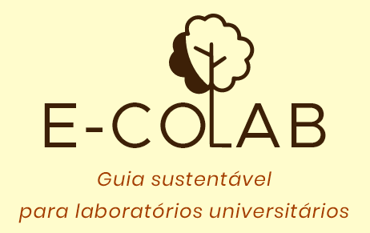

  

> Status do Projeto: Em andamento :construction:

## Descrição :star:

Plataforma Web do e-coLab - Guia Sustentável, projeto de extensão da UFSCar que oferece uma 
introdução de como tornar os laboratórios universitários mais sustentáveis com base na iniciativas Green Labs. 

## Objetivos da plataforma

:diamonds: Auxiliar a comunidade universitária a implantar medidas sustentáveis nos laboratórios

:diamonds: Documentar as ações que já são praticadas dentro dos laboratórios da UFSCar

:diamonds: Propor ações básicas para a redução no consumo de energia e desperdício de materiais

## Arquivos deste repositório

:pushpin: Pasta design: contém arquivos do design do site desenvolvidos no Adobe XD

:pushpin: Pasta wireframe: contém o wireframe do projeto

:pushpin: Pasta web: contém os arquivos HTML e arquivos de estilo (CSS, imagens, js)
